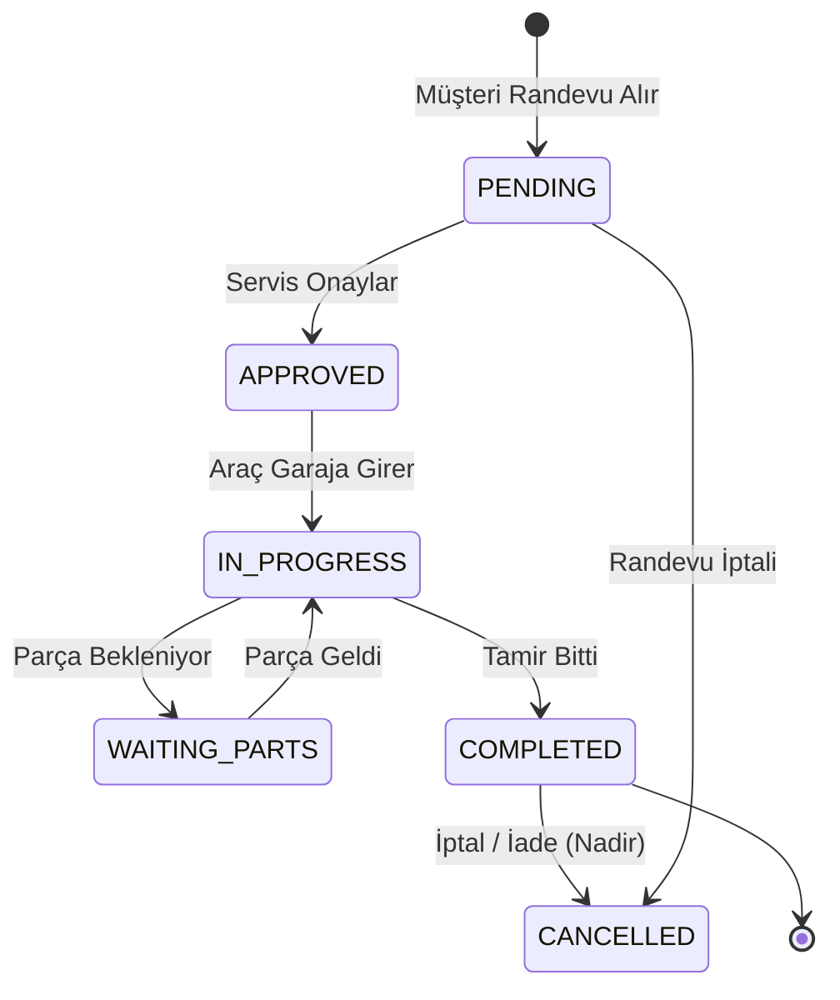

# 04. Domain Model & Business Rules

## 1. DDD (Domain-Driven Design) Audit

Kod tabanındaki mantıksal sınırların (Bounded Contexts) ve DDD desenlerinin analizi:

| Bounded Context | Aggregate Root | Value Objects | Domain Events | Repository | Durum |
| :--- | :--- | :--- | :--- | :--- | :--- |
| **CRM** | `Customer` | Email, Phone | - | Prisma `customer` | 🟡 Inferred |
| **Operations** | `WorkOrder` | Fiyat (Money), Tarih | `WorkOrderCreated` (Eksik) | Prisma `workOrder` | 🟡 Inferred |
| **AI Knowledge** | `Vehicle` | VIN, Plate | - | Prisma `vehicle` | 🟡 Inferred |

> [!CAUTION]
> **DDD İhlali (Violation):** Kodda gerçek `Repository` sınıfları (Örn: `WorkOrderRepository`) veya `Application Service` katmanları yoktur. Tüm iş mantığı `API Route` (Controller) içine gömülmüş "Transaction Script" modeliyle çalışmaktadır (Ana teknik borçlardan biri budur).

## 2. State Machine Diagrams (İş Emri & Randevu)

Mevcut Prisma şemasına (`WorkOrderStatus`) göre İş Emrinin (WorkOrder) durum makinesi:

**Guard (Geçiş) Kuralları Eksikliği:** Kodda `PENDING` durumundaki bir randevunun doğrudan `COMPLETED` durumuna atlamasını engelleyecek (Invariant Guard) bir state doğrulaması (Validation) bulunmamaktadır (❌ Not Implemented).

## 3. Business Rules Catalog (İş Kuralları Kataloğu)

| Entity | Kural (Invariant) | Kodda Karşılığı | Durum |
| :--- | :--- | :--- | :--- |
| **CustomerVehicle**| Bir plaka (Plate) sistemde benzersiz (Unique) olmalıdır. | `prisma/schema.prisma` L122 `@unique` | ✅ Verified |
| **WorkOrder** | Geçmiş tarihli randevu oluşturulamaz. | Zod / API katmanı | ❓ Evidence Insufficient |
| **AI Request** | Bir misafir günde 3'ten fazla AI sorgusu yapamaz. | `src/app/api/chat/route.js` L40 (Redis) | ✅ Verified |

---
**Confidence Level:** Medium (Prisma şeması doğrulandı ancak Backend Controller dosyalarının tamamı okunmadı).
