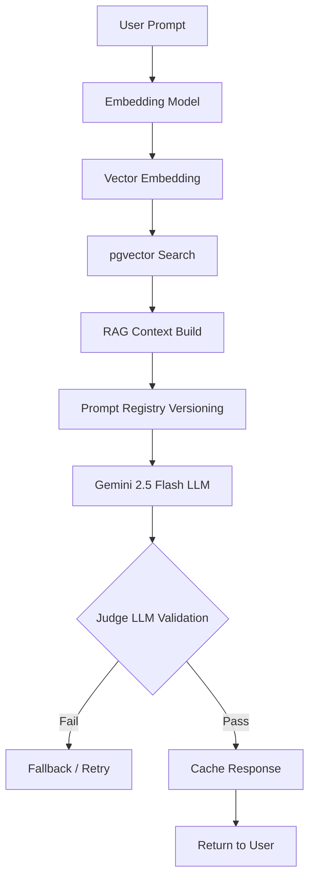

# 07. AI Lifecycle & Cost Matrix

## 1. AI RAG & Memory Lifecycle

Sistemin LLM Yanıt Üretme Akışı (Tam Diyagram):

### AI Kanıt Matrisi (Evidence)
- **Prompt Registry:** ✅ Var (`src/lib/ai/promptRegistry.js`).
- **Embedding Registry:** ❌ Yok (Model, Chunk boyutu, Overlap kod içinde dağınık).
- **Context Compression / Eviction:** ❌ Yok (Uzun sohbetlerde eski mesajları budayan bir bellek yöneticisi yok).
- **Judge Dataset (Evaluation):** ❓ Evidence Insufficient (Planlanmış ama Ground Truth seti yok).

## 2. AI Cost Matrix (FinOps Analizi)

Tahmini Maliyet (Cost) Analiz Tablosu (Gemini 2.5 Flash veya OpenAI eşdeğeri baz alınarak):

| Bileşen | Maliyet Türü | Optimizasyon Yöntemi | Mevcut Durum |
| :--- | :--- | :--- | :--- |
| **Embedding** | Token başı ($0.00x) | Cache Hits | Sık sorulan sorular Redis'te tutuluyor (✅). |
| **Prompt (Girdi)**| Token başı (Yüksek) | Context Compression | Eski sohbetler silinmiyor (❌ Risk: Maliyet Şişmesi). |
| **Completion** | Token başı (Orta) | Max Tokens limiti | Belirlenmemiş (❌ Risk: Geveze AI). |
| **Vector Search** | Compute (CPU/RAM)| pgvector HNSW/IVFFlat | Index türü belirsiz (🟡). |
| **Judge (Test)** | Token başı | Sadece CI/CD sırasında | Yazılmamış (❌). |

> [!TIP]
> AI maliyetlerini dramatik ölçüde düşürmek için, veritabanından çekilen RAG dokümanlarının LLM'e verilmeden önce bir **Reranking (Örn: Cohere Rerank)** işleminden geçirilmesi tavsiye edilir.

---
**Confidence Level:** High (Prompt Registry ve Cache mekanizmaları koddan doğrulandı, eksikler net tespit edildi).
