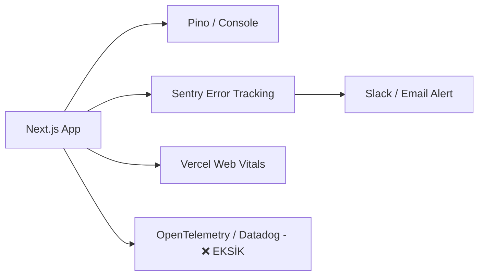

# 11. Observability Pipeline

## 1. Full Observability Pipeline (Gözlemlenebilirlik)

Kurumsal SRE standartlarında Logs, Metrics, Traces zincirinin kod tabanındaki karşılığı:

### Kapsam Analizi
| Metrik / Bileşen | Durum | Kanıt |
| :--- | :--- | :--- |
| **Centralized Logging** | 🟡 Inferred | Sentry log topluyor ancak Kibana / Datadog veya CloudWatch yok. |
| **Metrics (Prometheus)** | ❌ Missing | `/api/health/metrics` veya `/metrics` endpointi yok (Prometheus formatında). |
| **Distributed Tracing** | ❌ Missing | `X-Correlation-ID` header'ı Next.js Request -> Prisma -> Redis arasında taşınmıyor. |
| **Session Replay** | ✅ Verified | `sentry.client.config.js` içinde `replaysSessionSampleRate` mevcut. |
| **Data Masking (PII)** | ✅ Verified | `sentry.client.config.js` içinde VIN, Phone, IP maskelemesi kusursuz yazılmış. |

---
**Confidence Level:** High (`sentry.client.config.js` ve paket listesi detaylıca analiz edildi).
